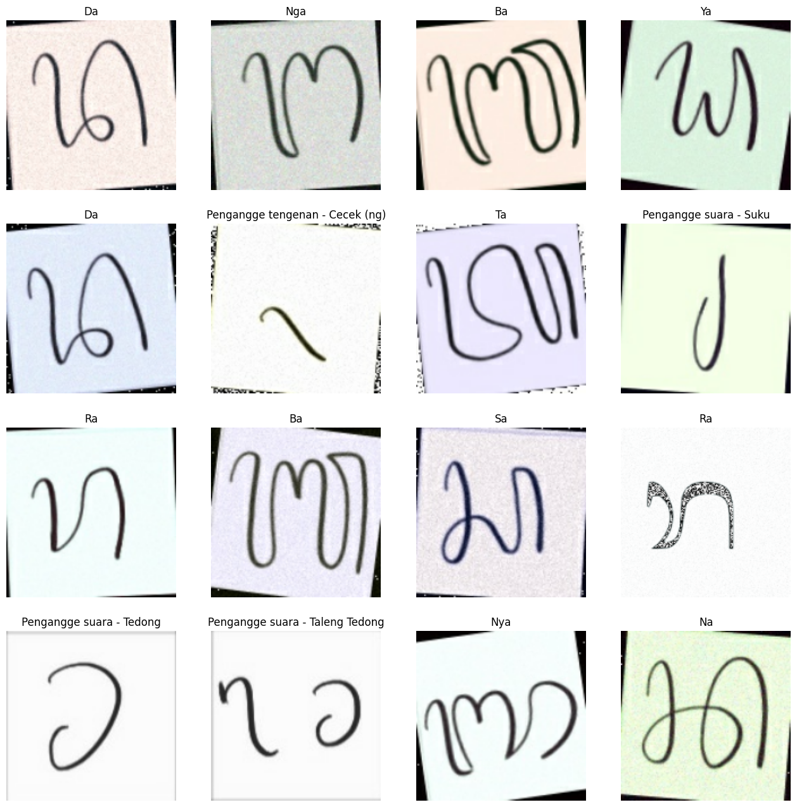
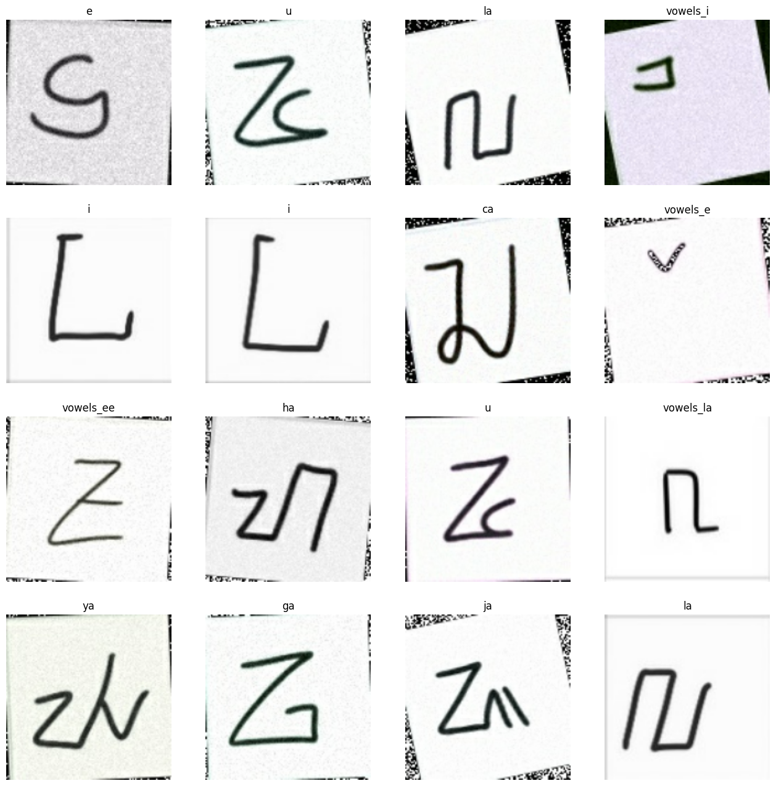
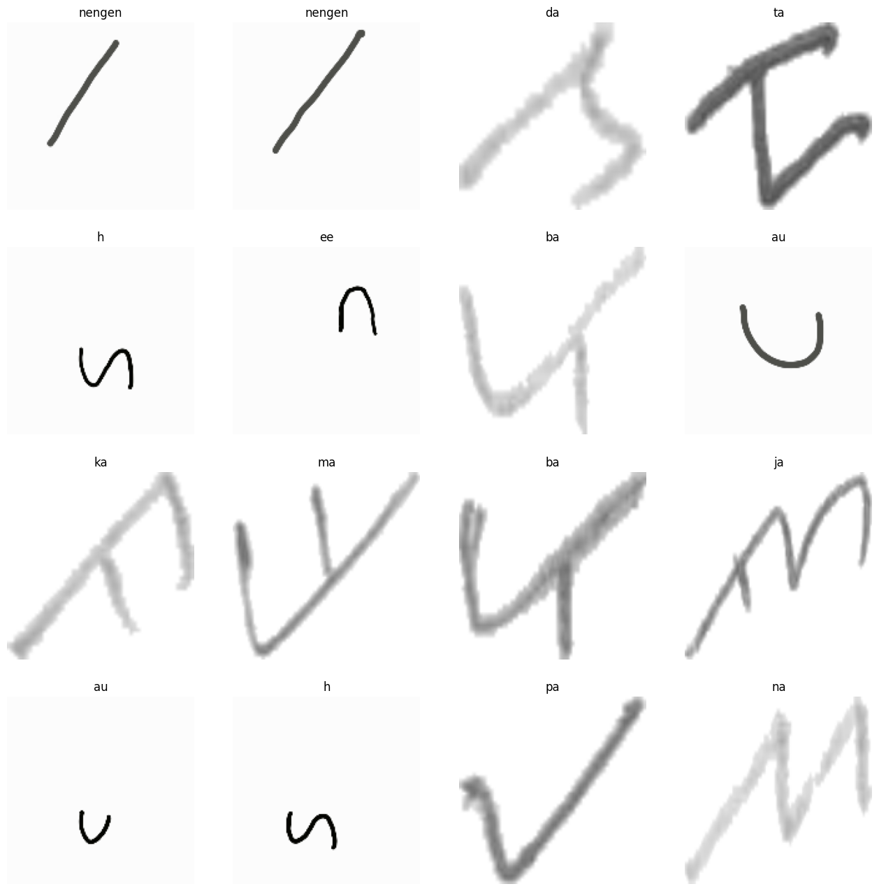

 

  

<h3 align="center">Data Pre-Processing</h3>

  

    Cleaning, Resize, and Augmentation on Datasets
  

 

## Overview

  
This repository constitutes an integral component of the machine learning workflow, serving as the primary source of data for training the model. It contains meticulously curated datasets that have undergone thorough cleaning processes.

## Workflow

 

* `Gathering and Creating Datasets` :
We gather data from <a href="https://www.kaggle.com/datasets/anggitpambudihutomo/aksara-lampung-handwriting-dataset"> Kaggle </a> and additionally create our own dataset by hand-drawing Indonesian scripts.
* `Image Cleaning`: We employ the OpenCV-Python library to perform data preprocessing tasks such as cleaning, grayscale conversion, binarization, and resizing.
* `Augmentation` : We utilize the `imgaug` library to apply rotation and shear transformations to images within a canvas, adapting the size based on input parameters.
* `Train/Val splits`: We partition the datasets using an 80:20 ratio.

## Contributors

|Name |Bangkit ID| University|
|-----|----------|-----------|
|<a href="https://www.linkedin.com/in/jonekaa">Jonathan Eka     | M244BSY0067| Universitas Kristen Petra|
|<a href="https://www.linkedin.com/in/gathaaa">Agatha Angelina  | M244BSX0068| Universitas Kristen Petra|
|<a href="https://www.linkedin.com/in/edinaalana">Edina Alana   | M296BSX1153| Universitas Pembangunan Nasional Veteran Jawa Timur|
